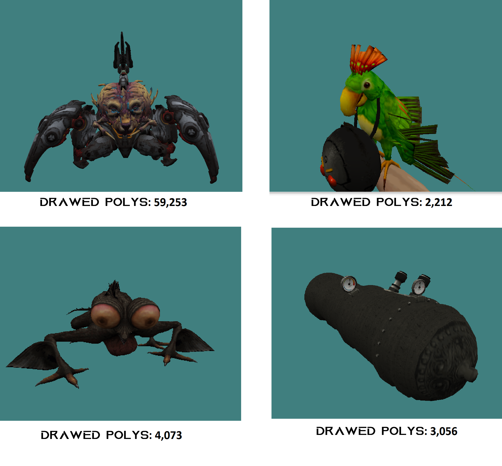

# S2GConverter
Python utility converting models from Source engine to GoldSource engine. This utility can convert models with any number of polygons and animations. 


## How to use? 

1) Install required python package

```
pip install Pillow
```
2) Prepare folder with model files. Create a new folder and copy there all files using by model. These are:
    1) .mdl file
    2) .vmt files
    3) .vtf files
    4) .vtx file
    5) .vvd file
   
3) Execute python script with the cmd

```
python S2GConverter.py -i Path\To\The\Model.mdl
```
4) Find result in the folder you created at the start. It will be: your_model_name_goldsource.mdl

## Which models aren't supported?

There are two situations yet, when the model can't be converted. These are:

1) The model contains sequences larger, than 64Kb. 
2) The model has 129 and more bones. 

## Results examples

 
 
 
 ## Credits and Links
 
 1) Дядя Миша's studiomdl.exe https://hlfx.ru/forum/showthread.php?s=&threadid=5237
 2) VTFLib - https://nemstools.github.io/subpages/Comments/VTFEdit_v1.3.3_Full-page2.html#p238
 3) Sources of models demonstrated here
    1) Serious Sam 2 SWEPS: https://steamcommunity.com/sharedfiles/filedetails/?id=503138986
    2) DOOM Eternal NPCs: https://steamcommunity.com/sharedfiles/filedetails/?id=2295322924
    3) Dark Souls NPCs reworked: https://steamcommunity.com/sharedfiles/filedetails/?id=1254104064  

## Contacts

if you have questions about usage / you encounter a model that the utility was unable to process / you have another problems, my contacts are:

1) E-Mail: pristavka_egor@mail.ru
2) Steam: https://steamcommunity.com/id/mrglaster
3) VK: vk.com/pristavka2013
